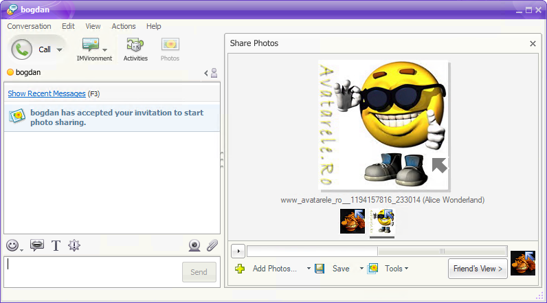
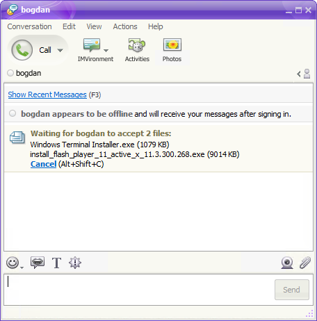
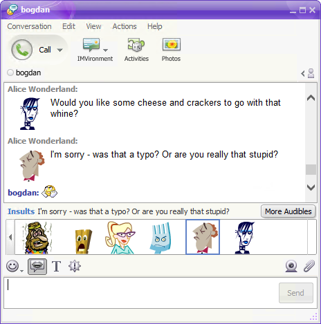
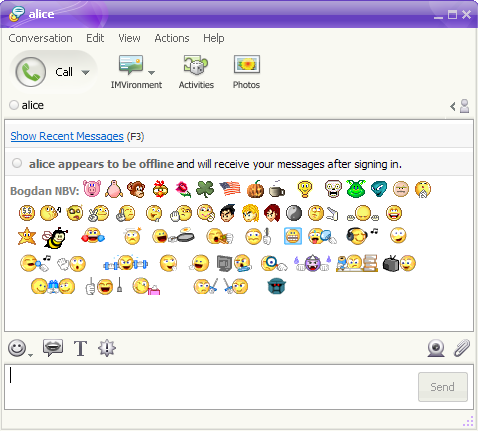

# Buzzd Chat v1.0 Now Available!! 🥳

> _The Content Update_

**We're happy to announce that the first "stable" version of our service is now available!**

Even though it took longer than first estimated, the feature implementations should be rock solid with minimal bugs, if any (lmao).

#### If you're new, please follow one of the [getting started guides](../../index.md).
Otherwise, proceed to the update instructions.

## How to update
1. Download & install [Flash Player](../../downloads/flash-player.md) (required by Audibles and future content updates).
2. Download the latest [BZDPatcher](../../downloads/bzd-patcher.md) version.
3. Patch Yahoo! Messenger.
4. Enjoy! :D

## New Features
### 1. [Photo Sharing](https://www.youtube.com/watch?v=QgUXWmwg5Ts)

### 2. [File Sharing](https://www.youtube.com/watch?v=9rUyqyAl4VM)

### 3.  [Audibles](https://www.youtube.com/watch?v=IiU8yBd2E74) (requires [Flash Player](../../downloads/flash-player.md))

### 4. Emoticons (added missing "secret" ones)

### 5.  Spam reporting
- Now you can report users for spam and ignore them in just one click

## Bug Fixes
- Fixed a bug when accepting a friend invite, the users were wrongly notified of each other's presence

## Misc
- Complete overhaul of the `ymsg.SafeMap` implementation
- Drop the usage of `sync.Pool` where not absolutely necessary
- Added client update checks
- Added banning system to easily ban users from the admin dashboard 

## Special thanks
- **xsl1ck** - for being there from the beginning and managing the community so well
- [Bastanu2016](https://www.youtube.com/@Bastanu-qj2ll) - for allowing us to use his [8bit version of "Un trandafir creste la firida mea"](https://www.youtube.com/watch?v=2tTY6A5XisU)
