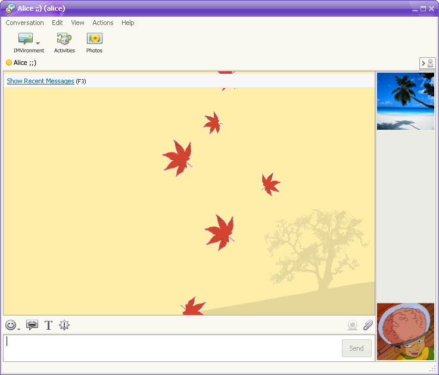
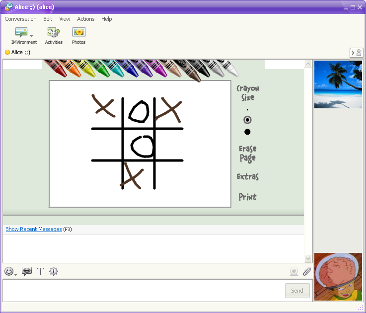
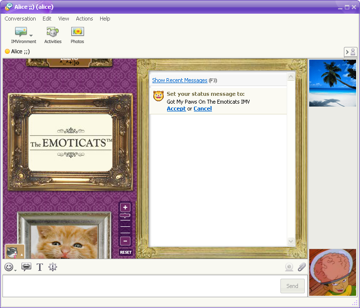
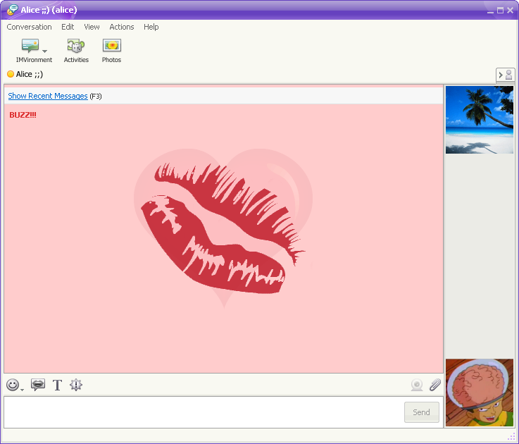
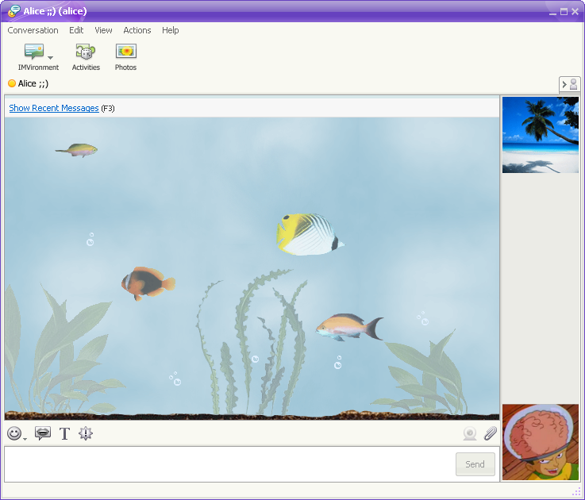
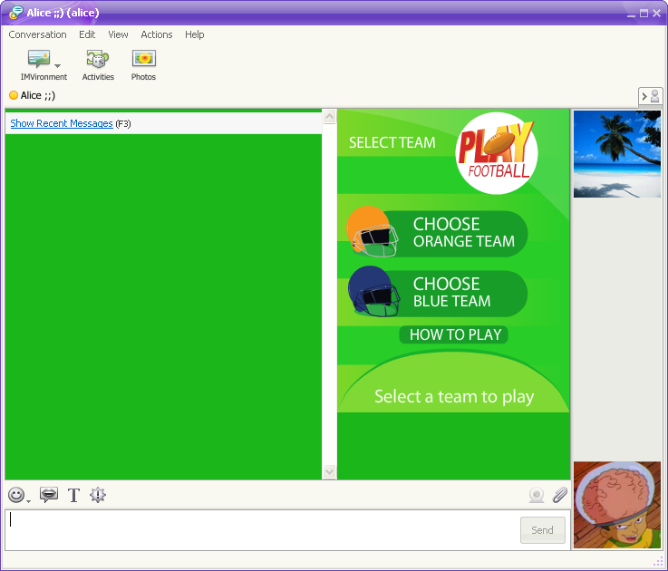
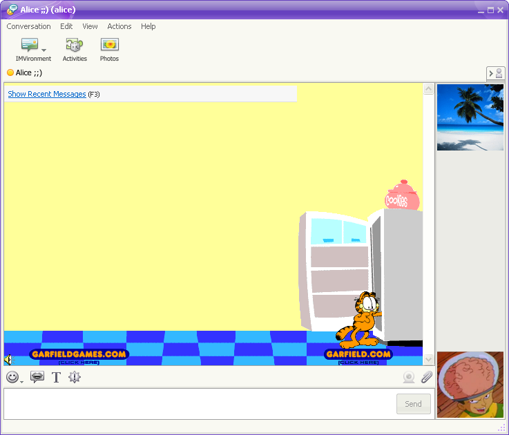
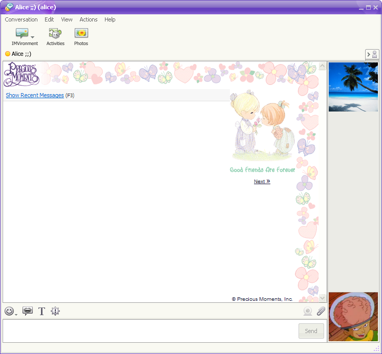
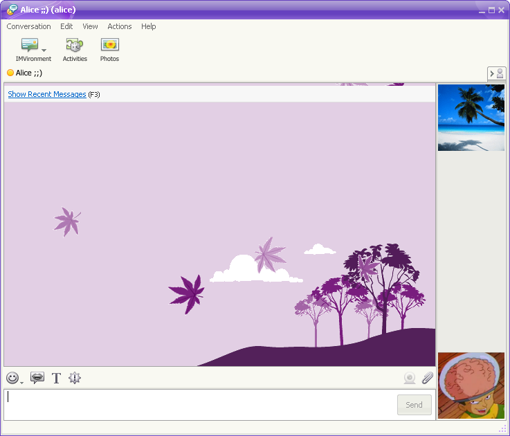
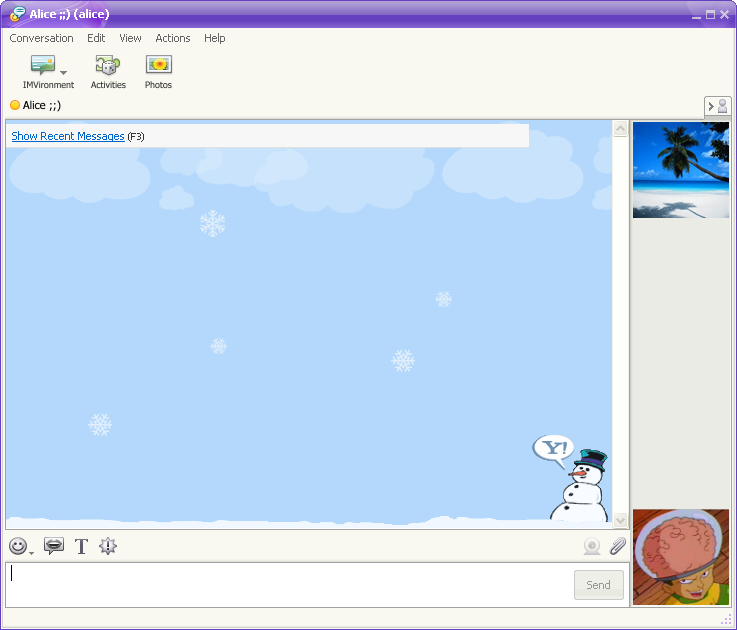

# IMVironments just landed!! 🤩

> _IMVironments ("IMVs") are interactive backgrounds that you can add to your IM conversations._

It's been quite the journey to get them working, mostly due to the very little information available online and most of them being essentially [lost media](https://en.wikipedia.org/wiki/Lost_media).

The [publicly archived IMVs](https://web.archive.org/web/*/http://us.dl1.yimg.com/download.yahoo.com/dl/imv/*) (`.yim` files) have been really helpful in reverse engineering the [Cabinet archive](https://en.wikipedia.org/wiki/Cabinet_(file_format)) signature mechanism as well as the `.imv` file encryption.  
However, because the latest snapshots are from 2005/2006, the code inside the `.imv` files (JS + HTML) is incompatible with the latest versions of Y!M (8 and above) .

By June 2025 we already started looking for old second-hand laptops and [asking the community](https://wink.messengergeek.com/t/tracking-down-lost-media-content-buzzd-chat-psa/26115) if, by any chance, they have access to old PCs with Y!M still installed.

Four laptops, [a random PC found in an office](./100-new-audibles.md#special-thanks) and a few archives from our community members later, we managed to gather multiple, more recent, IMVs from around 2012 to 2015. 

<!-- more -->

## Without further ado, here they are

### 1. [Autumn Leaves](https://web.archive.org/web/20091223021256/http://messenger.yahoo.com/imvironments/view/leaves/)

> Watch autumn leaves fall with this IMVironment, and make them blow with the wind when you Buzz your friends (Ctrl + G).

### 2. [Doodle](https://web.archive.org/web/20091223021156/http://messenger.yahoo.com/imvironments/view/doodle/)

> Everyone has a little bit of an artistic streak in them. Express yourself, and create a great work of art with your friends with this neat IMVironment! After you're done, you can print your work of art to show off to your friends and family. Or if drawing isn't your thing, there are some neat games to try.

### 3. [Emoticats](https://web.archive.org/web/20091223020347/http://messenger.yahoo.com/imvironments/view/emoticats/)

> Love emoticons? Now you can adopt an "Emoticat®" as your display image or just insert one into your conversation. Open it up and start turning the cat photos into emoticons by zooming in on each cat!

### 4. [Falling Hearts](https://web.archive.org/web/20091223021444/http://messenger.yahoo.com/imvironments/view/hearts/)

> What better way to show you care, than with an IMVironment that comes from the heart. For that extra special someone, use the buzz feature (Ctrl + G) to give your loved one a virtual kiss.

### 5. [Fishtank](https://web.archive.org/web/20091223021322/http://messenger.yahoo.com/imvironments/view/fishtank/)

> Looking for a virtual fish tank to calm your day? Download our Fishtank IMVironment and watch the colorful fishes swim around effortlessly. A great way to relieve stress as you chat with a friend or have it open in your desktop while you work.

### 6. [Football Kick](https://web.archive.org/web/20091223021209/http://messenger.yahoo.com/imvironments/view/footballkick/)

> Think you've got a winning foot? Challenge your friend to a game of Football Kick to determine a champion. Use the arrow keys to adjust the direction of the ball, and then hold the spacebar down to let it fly. The first player to score 3 points wins!

### 7. [Garfield](https://web.archive.org/web/20130720102904/http://messenger.yahoo.com/imvironments/view/garfieldgames/)

> Look who's raiding the refrigerator... it's your old pal Garfield! Andy our friend can help him rummage for a tasty snack simply by typing a message to you.  Be sure to buzz a friend (Ctrl + G) to see another snacktime visitor.

### 8. [Precious Moments](https://web.archive.org/web/20091223020424/http://messenger.yahoo.com/imvironments/view/precious/)

> Send a smile to friends and family with this adorable Precious Moments IMVironment. Scroll through five totally cute Precious Moment backgrounds, then hit Ctrl-G to share a giggle and some instant message fun.

### 9. [Purple Leaves](https://web.archive.org/web/20091223020222/http://messenger.yahoo.com/imvironments/view/purpleleaves/)

> Fall is here and Purple is this season's biggest color. Celebrate fall by watching these gently falling purple leaves flutter in the breeze. Be stylish and stress-free at the same time.

### 10. [Snowflakes](https://web.archive.org/web/20091223021245/http://messenger.yahoo.com/imvironments/view/snowflake/)

> Start a virtual snowball fight with your friends using the Snowflake IMV! Just open it up, hit buzz (Control + G) and watch the snowballs fly!

## Special thanks 
To these amazing community members, in no particular order:

- [**@nenea33**](https://www.tiktok.com/@mynameis_nenea33) - for the 2015 Y!M `11.5` archive
- **@JasonN** - from our Discord server, for the 2014 Y!M `10.0` archive
- **@aLinux** - from [RetroTech.ro](https://retrotech.ro/forum/), for the 2011 Y!M `10.0` archive
- **@Nyehmeh** - from [Flashpoint Archive](https://flashpointarchive.org/discord), besides the huge amount of audibles he gave us, he also archived some IMVs

## What's next?

This is just a part of all the IMVs that we have, the others, as mentioned before, are not compatible with later versions of Y!M.  
However, there is hope, we'll try and update them to work with our project's supported Y!M versions and gradually release them.

There is one caveat though, the IMVironments feature was designed more as a marketing/advertising tool, so most of the IMVs were essentially ads on steroids.  
We'll try and revive as many ass possible, but we'll also try and keep the advertising to a minimum. For example, if an IMV doesn't have anything interactive or fun about it and is just a big ol' ad, we'll most probably skip it over.

We're also going to continue the hunt for old laptops and archives from our community. There must be a ton of regional IMVs that we don't even know about!
