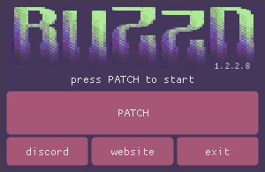

# BZDPatcher - `1.2.2`

!!! danger  "Downloading executables from the internet is always dangerous!"
    Please use caution and common sense when downloading and executing files from the internet.
    If you're not sure about a file you just downloaded, please use a tool such as **[VirusTotal](https://www.virustotal.com)** to scan it first!

[:fontawesome-solid-download: BZDPatcher_1.2.2.zip](./files/BZDPatcher_1.2.2.zip){ .md-button .md-button--primary }

- SHA256: `d56dfa683fdcc1449c1e2555b577a707bb2a83653bf173d7066755b9bcf78ffb`
- VirusTotal: [8ddf43e30a84d337b329774aef1060aa0320cab4cbea9e2e6047ddfbf8d0fde6](https://www.virustotal.com/gui/file/d56dfa683fdcc1449c1e2555b577a707bb2a83653bf173d7066755b9bcf78ffb)
- Music: Thanks to [Bastanu2016](https://www.youtube.com/watch?v=2tTY6A5XisU) 🫡 

## Supported clients
- [**Yahoo! Messenger** `9.0.0.2162`](./yahoo-messenger.md#version-9002162)

## Changelog

!!! tip "#Version 1.2.2"
    - Added logging - you'll be able to find the patching logs in `%temp%\bzdpatcher.log`
    - Added better checking for running Y!M processes
    - Updated [`nlohmann::json`](https://github.com/nlohmann/json) library from `3.11.3` to `3.12.0`
    - Fixed a bug with configuration JSON loading and parsing
    - Fixed `successfuly` to `successfully` typo
