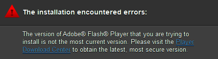

# Flash Player

!!! danger  "Downloading executables from the internet is always dangerous!"
    Please use caution and common sense when downloading and executing files from the internet.
    If you're not sure about a file you just downloaded, please use a tool such as **[VirusTotal](https://www.virustotal.com)** to scan it first!

{ width=400 }

## **Version** `11.3.300.268 - ActiveX`
[:fontawesome-solid-download: flash-player-113300268-ax.zip](./files/flash-player-113300268-ax.zip){ .md-button .md-button--primary }

- SHA256: `a271313264f9e4a2526b6a01b6bfe5819400e0b8bb640c3daeb4f5571fdca419`
- VirusTotal [a271313264f9e4a2526b6a01b6bfe5819400e0b8bb640c3daeb4f5571fdca419](https://www.virustotal.com/gui/file/a271313264f9e4a2526b6a01b6bfe5819400e0b8bb640c3daeb4f5571fdca419)

## **Version** `10.3.183.48 - ActiveX`
[:fontawesome-solid-download: flash-player-10318348-ax.zip](./files/flash-player-10318348-ax.zip){ .md-button .md-button--primary }

- SHA256: `ef23477c77579d84fac8a7a56f29bf1e51f515627800e3c9499d38ad750a9a69`
- VirusTotal: [ef23477c77579d84fac8a7a56f29bf1e51f515627800e3c9499d38ad750a9a69](https://www.virustotal.com/gui/file/ef23477c77579d84fac8a7a56f29bf1e51f515627800e3c9499d38ad750a9a69)

---

# **Troubleshooting**

If you're encountering this error, please try:

1. **Download and run the uninstaller for Flash Player.**
2. **Retry installing Flash Player.**

[:fontawesome-solid-download: uninstall_flash_player.exe](./files/uninstall_flash_player.exe){ .md-button .md-button--primary }  

- SHA256: `a967fe37132dfc787f3df0c6836ad7b44abc209826cbf34564ecafc0ff229a2b`  
- VirusTotal: [a967fe37132dfc787f3df0c6836ad7b44abc209826cbf34564ecafc0ff229a2b](https://www.virustotal.com/gui/file/a967fe37132dfc787f3df0c6836ad7b44abc209826cbf34564ecafc0ff229a2b)

??? danger "Still having this issue? Click here"
    ### If the issue persists, as a **last resort**:  
    1. **Download and run the `Unflasher` utility**  
    2. **Retry installing Flash Player.**

    **Disclaimer**: This utility is designed to run with the highest privileges available. Your antivirus might flag it as a virus.

    [:fontawesome-solid-download: Unflasher.exe](./files/Unflasher.exe){ .md-button .md-button--primary }  
    SHA256: 8af9d3581d0a74ddf940554d1d72cdd80ec8ea2dcb7fb6140d7699813666fca0  
    VirusTotal: [8af9d3581d0a74ddf940554d1d72cdd80ec8ea2dcb7fb6140d7699813666fca0](https://www.virustotal.com/gui/file/8af9d3581d0a74ddf940554d1d72cdd80ec8ea2dcb7fb6140d7699813666fca0)
