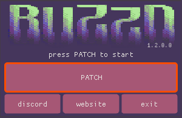
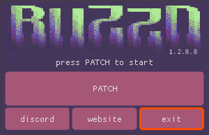

# Getting Started

!!! danger "Using outdated software is [dangerous](https://youtu.be/DduAbLpZDHg?si=hMtWY4OpSFmAlcX6)!"
    [The **TLS version** used by the Yahoo! Messenger client is deprecated](https://www.ietf.org/rfc/rfc8996.html) and considered **insecure** by modern cryptographic standards!  
    The **protocol** that Y!M uses is a ["**plaintext**"](https://en.wikipedia.org/wiki/Plaintext) one, meaning that it's **not secure** and any data (e.g.: messages) transmitted through it is **not encrypted** in any way, shape or form.

<video autoplay loop muted playsinline>
<source src="./videos/installation.webm" type="video/webm">
</video>

!!! warning "Proceed only if you fully understand the risks you're possibly exposing yourself to!"

## Requirements

* Windows `XP SP3` and above (`Vista`, `7`, `8`, `8.1`, `10`, `11`)
* [Yahoo! Messenger](./downloads/yahoo-messenger.md)
* [BZDPatcher](./downloads/bzd-patcher.md)
* [Flash Player](./downloads/flash-player.md)

---
## 1. [Create & verify](https://buzzd.chat/register) your account
In order to use the service, you'll first have to [register and verify](https://buzzd.chat/register) your account
!!! notice "Please be patient, it may take a few minutes for the email to arrive."

---
## 2. Install [Yahoo! Messenger](./downloads/yahoo-messenger.md)
You can download the Y!M Client installer for your desired version [from here](./downloads/yahoo-messenger.md).  
The installation process should be fairly straightforward, just as you remember it.

---
## 3. Install [Flash Player](./downloads/flash-player.md)
[Download](./downloads/flash-player.md) whichever version you want and install it as usual.

!!! tip "Having issues installing Flash Player?"
    Please visit the [troubleshooting section.](./downloads/flash-player.md#troubleshooting)

---
## 4. Patch using [BZDPatcher](./downloads/bzd-patcher.md)
For the client to be able to connect to the Buzzd services, some patching is required.  
[BZDPatcher](./downloads/bzd-patcher.md) can be downloaded [from here](./downloads/bzd-patcher.md)

!!! warning "Make sure Yahoo! Messenger is COMPLETELY closed before proceeding, from the taskbar too."
    

#### 4.1. Start Patching
After downloading and starting BZDPatcher, press the PATCH button:

#### 4.2. Open YahooMessenger.exe
Select and Open the Yahoo! Messenger executable:

#### 4.3. Close the patcher
Once the patching has completed successfully, you can close the patcher:

---
## 5. Log in!!!
If everything went well, you can now start Yahoo! Messenger and log-in using your [Buzzd.Chat](https://buzzd.chat) **username**.

