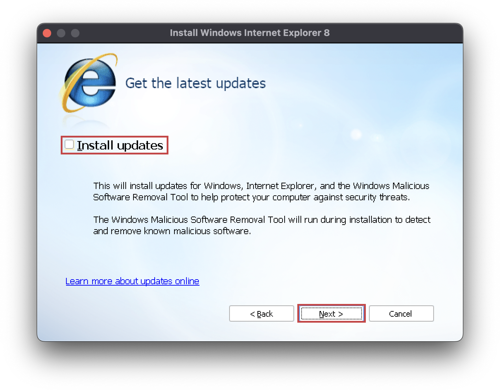

# macOS

!!! danger "Using outdated software is [dangerous](https://youtu.be/DduAbLpZDHg?si=hMtWY4OpSFmAlcX6)!"
    [The **TLS version** used by the Yahoo! Messenger client is deprecated](https://www.ietf.org/rfc/rfc8996.html) and considered **insecure** by modern cryptographic standards!  
    The **protocol** that Y!M uses is a ["**plaintext**"](https://en.wikipedia.org/wiki/Plaintext) one, meaning that it's **not secure** and any data (e.g.: messages) transmitted through it is **not encrypted** in any way, shape or form.

!!! note "Disclaimer"
    This method is extremely janky and unreliable and your mileage will definitely vary

??? example "Known issues"
    - Chat windows don't pop-up, but do appear in the dock
    - Sleeping the device will most probably make Y!M unresponsive, you'll have to forcefully close it
    - Battery life may be affected?? (more testing needed)

## Requirements

* An Apple Silicon SoC (M-series chips) device
* macOS Sonoma (`14.0`) or later
* [Whisky (a Wine wrapper)](https://docs.getwhisky.app/#a-hitchhikers-guide-to-whisky)
* [Yahoo! Messenger](./downloads/yahoo-messenger.md)
* [BZDPatcher](./downloads/bzd-patcher.md)
* [Flash Player](./downloads/flash-player.md)

---
## 1. Setting up the [Whisky](https://docs.getwhisky.app/#a-hitchhikers-guide-to-whisky) Bottle
After installing [Whisky](https://docs.getwhisky.app/#a-hitchhikers-guide-to-whisky) we can start setting-up the "bottle" (wine prefix) where Yahoo! Messenger will be installed.

#### 1.1. Create a new `Windows XP` bottle called "Buzzd Chat"

#### 1.2. Install `Internet Explorer 8` via `Winetricks`

!!! warning "A terminal window will open, DO NOT CLOSE IT until after IE8 is installed."
    

**An IE8 install window should pop-up, proceed with its installation as usual**

!!! warning "Make sure to disable the Install Updates option during the installation process."
    

!!! warning "Wait for the terminal opened earlier to finish executing all commands before proceeding!"
    

---
## 2. [Creating & Verifying](https://buzzd.chat/register) your account
In order to use the service, you'll first have to [register and verify](https://buzzd.chat/register) your account
!!! notice "Please be patient, it may take a few minutes for the email to arrive."

---
## 3. Install [Yahoo! Messenger](./downloads/yahoo-messenger.md)
You can download the Y!M Client installer for your desired version [from here](./downloads/yahoo-messenger.md).  
The installation process should be fairly straightforward, just as you remember it.

**A few `Next`s later...**

---
## 4. Install [Flash Player](./downloads/flash-player.md)
[Download](./downloads/flash-player.md) whichever version you want and install it as usual.

---
## 5. Patch using [BZDPatcher](./downloads/bzd-patcher.md)
For the client to be able to connect to the Buzzd services, some patching is required.  
[BZDPatcher](./downloads/bzd-patcher.md) can be downloaded [from here](./downloads/bzd-patcher.md)

!!! warning "Make sure Yahoo! Messenger is COMPLETELY closed before proceeding, from the taskbar too." 

#### 5.1. Press PATCH!
After downloading and starting BZDPatcher, press the PATCH button:

#### 5.2. Open YahooMessenger.exe:
Select and Open the Yahoo! Messenger executable:

#### 5.3. Close the patcher
Once the patching has completed successfully, you can close the patcher:

---
## 6. Log in!!!
If everything went well, you can now start Yahoo! Messenger and log-in using your [Buzzd.Chat](https://buzzd.chat) **username**.

**Double click on the pinned YahooMessenger app in Whisky**

